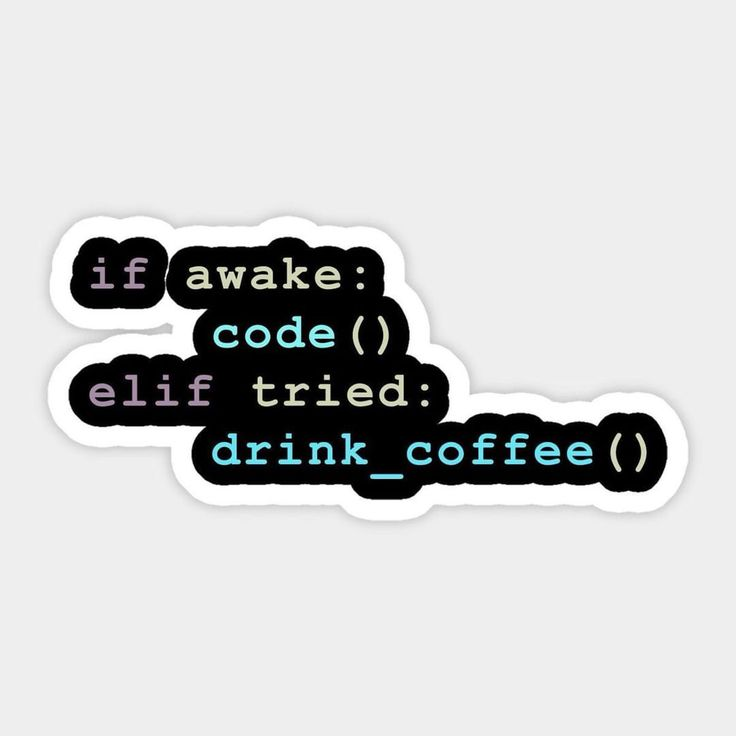

<h1 align="center">Hi 👋, I'm Tanisha Bansal</h1>
<h3 align="center">A passionate Frontend Developer and Machine Learning enthusiast from India</h3>

  

  

- 🔭 I’m currently working on **Machine Learning and Deep Learning Projects**

- 🌱 I’m currently learning **Android Development**

- 👯 I’m looking to collaborate on **Machine Learning and Full Stack Projects**

- ⚡ Fun fact **When I’m not coding, you’ll find me painting, singing, or dancing.**

## 🌐 Connect with me:

## 💻  Languages and Tools:

  
  
  
  
  
  
  
  
  
  
  
  
  
  
  
  
  
  
  
  
  
  
  
  
  
  
  
  
  
  
  

&nbsp;

---
### ☕ Coding and Coffee: A Developer's Bliss  

  
  
<em>"Behind every great code, there’s a cup of coffee brewing in the background."</em>

---

